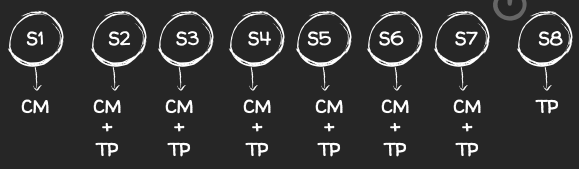
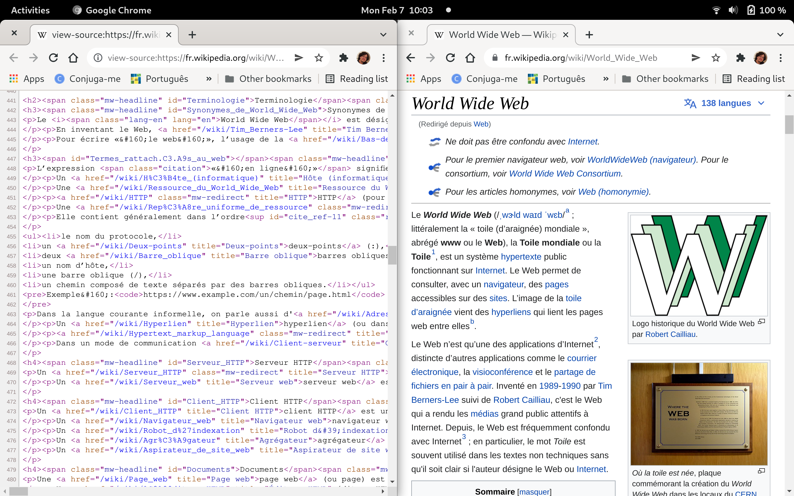

## Initiation Web (G1INWEB)

--- 
### Enseignants 
- CM + TP (G3): Carlos Olarte
- Nathalie Pernelle
- Yasmine Chouikha
- Mario Valencia
- Alexandre Louvel

email: <olarte@lipn.univ-paris13.fr>

---
### Objectives
- Découvrir les notions de base sur le fonctionnement
  du modèle _client-serveur_. 
- Écrire et modifier des pages Web dans un langage normalisé de description de
  contenus (__HTML__).
- Modifier les attributs de présentation d’une page Web (__CSS__). 

---
### Compétences visées 
- Être capable de formater et de modifier des documents dans le langage _HTML_. 
- Être capable de mettre en œuvre des feuilles de
styles  (__CSS__). 

---
### Organisation 
- 7 CMs (10.5 heures) 
- 7x2 TPs (21 heures)

---
### CMs
- __CM1__: Introduction au fonctionnement du Web + HTML 
- __CM2__: HTML (continuation)
- __CM3__: CSS (introduction et propriétés) 
- __CM4__: CSS (flexbox et ordre d'application)
- __CM5__: CSS (classes et pseudo-classes)
- __CM6__: Responsive design
- __CM7__: Mettre votre site en ligne

---
### TPs
Nous allons suivre le cours en ligne 
[Apprenez à créer votre site web avec HTML5 et CSS3](https://openclassrooms.com/en/courses/1603881-apprenez-a-creer-votre-site-web-avec-html5-et-css3)

- TP1 : Partie 1 (1-5, HTML)
- TP2 : Partie 1 (6,7) + __exo noté__
- TP3 : Partie 2 (1-5, CSS)
- TP4 : Partie 2 (6,7) + __exo noté__
- TP5 : Partie 3
- TP6 : Partie 4 (1-3)
- TP7 : Création site + __exo noté__

---
### Emploi du temps

---
### Emploi du temps


* _10.02_ :  CM1
* _17.02_ :  CM2 + TP1
* _24.02_ :  CM3 + TP2
* __03.03__ :  __Vacances__
* _10.03_ :  CM4 + TP3
* _17.03_ :  CM5 + TP4
---
### Emploi du temps


* __24.03__ :  __Partiel 1__
* _31.03_ :  CM6 + TP5
* _07.04_ :  CM7 + TP6
* _14.04_ :  TP7
* __19.05__ :  __Partiel 2__

--- 
### Évaluation 
- Note: (EVC + 2Pa) / 3
- _EVC_: 3 TP noté 
---
### Références et ressources 
- Le langage CSS (Wikilivres) https://fr.wikibooks.org/wiki/Le_langage_CSS
- Le langage HTML (Wikilivres) https://fr.wikibooks.org/wiki/Le_langage_HTML
---
## CM1
### Fonctionnement du web
---
### Fonctionnement du web
Nous allons répondre aux questions suivantes :
- Comment l'_Internet_ fonctionne ? 
- Qu'est-ce que c'est la __Web__ ?
- Qu'est-ce que c'est le modèle _client-serveur_ ?
- Comment écrire une page Web ?

---
### Réseau 
Machines connectées ensemble

---
### Internet 

Réseau connectant tous les réseaux

---
### Web 
Application permettant de consulter des pages Web à l'aide d'un _navigateur_. 

- Caractérisé par des _hyperliens_
- Publique ! 
- Distinction entre client et serveur
- Fonctionne sur Internet 

> _WWW_ (world wide web):   toile (d'araignée) mondiale

---
### Web et Internet
- Web est une des _applications_ d'Internet
- Autres applications : courrier électronique, streaming, vidéoconférence, etc. 
- _Internet_: réseau informatique (réseau de réseaux)
- _Internet_: système de communication capable d’envoyer des données par paquets 
- En 1983, le nom "Internet" devient officiel.  
- La Web a été inventé en 1989-1990 par Tim Berners-Lee
---

### Navigateur 
Logiciel qui permet la visualisation de pages Web 


...

---
### HTML
Langage de _balises_ permettant d'écrire des pages Web
```html
<h1> Functionnement du Web </h1>
<ul>
  <li> Client  </li>
  <li> Serveur </li>
  ...
</ul>
```
> HTML : HyperText Markup Language
---

### Question
Voici l'adresse d'un site:

https://www.univ-paris13.fr/

C'est quoi `https://` ? et `univ-paris13.fr` ?

---
### URL : Uniform Resource Locator
_Localisateur Universel de Ressources_

`nom-du-protocole://adresse-du-site/chemin-du-repertoire/fichier`

- _nom-du-protocole_ : langage utilisé pour la communication entre ordinateurs.
- Protocole pour la Web : __http / https__
- _adresse-du-site_ : Adresse du serveur 
- _chemin-du-repertoire_ : répertoire où se trouve le fichier
- _fichier_ : nom du fichier que l'on veut afficher

---
### Protocoles 
#### Transport et Réseau
-  TCP / IP  : (Transmission Control Protocol / Internet Protocol) 

#### Application 
- __http__ (hyper text transfer protocol) 
- __https__ (http + chiffrement)
- ftp
- imap / smtp
- ...
---
### Adresse du site

_adresse-du-site_ : Adresse IP ou nom du serveur. 

> Adresse IP : numéro d'identification attribué à chaque matériel informatique   connecté à un réseau utilisant l'_Internet Protocol_ (IP). 
- 4 nombres d'un octet chacun (32 bits)
- nombres compris entre 0 et 255
- Par exemple: 

```
ping google.com
PING google.com (216.239.38.120) 56(84) bytes of data.
```
- _DNS_: Système de résolution de noms 

``` 
google.com => 216.239.38.120
```
---
### URL : Uniform Resource Locator

_Repertoire et fichier_

Quel fichier va être affiché ?

https://www.univ-paris13.fr/

---
### URL : Uniform Resource Locator
_Repertoire et fichier_

Quel fichier va être affiché ?

https://www.univ-paris13.fr/

> `index.html`, `index.php`, etc. 
---
### Le modèle client-serveur
Une analogie
- _Client_  -> _Serveur_: (__requête__) Un café svp 
- _Serveur_ : Préparation du café 
- _Serveur_ -> _Client_ : (__réponse__) voici votre café 
---
### Le modèle client-serveur
Modèle apparu dans les années 1970 (Xerox PARC)
#### Serveur 
> Un _serveur_ est un ordinateur (et/ou un programme informatique) offrant un
> service ou une ressource sur un réseau.

#### Client 
> Un _client_ est un programme informatique contactant un serveur via un
> réseau, afin de bénéficier d’un service ou d’une ressource

---
### Le modèle client-serveur
Un ordinateur/logiciel offrant un _service_...

Quel type de service ? 
---
### Le modèle client-serveur
Un ordinateur/logiciel offrant un _service_...

Quel type de service ? 

> Ici nous nous intéressons aux serveurs de pages Web !

---
### Le modèle client-serveur
#### Web Server
- Ordinateur affecté au stockage des pages Web et au traitement des _requêtes_ provenant des __clients__


#### Frameworks,  SGBD ...


...

---
### Le modèle client-serveur
#### Client
- Ordinateur, portable, tablette, smartphone, etc. 
- Navigateur 


...

- La _compatibilité_ peut être un problème 
- https://caniuse.com/

---
### Le modèle client-serveur

- Comment établir la communication entre le client et le serveur?
---
### Protocole HTTP
- Client: _requête_ "je voudrais https://www.univ-paris13.fr/"
- Traitement : préparation de la page Web
- _Réponse_ : code (HTML) pour être visualisé pour le navigateur
---
### Protocole HTTP
Métodes de requêtes 
- _GET_ : demander une ressource 

```
GET docs/page.html
```
 le serveur renvoi le fichier `page.html`
---
### GET
```
https://www.google.com/search?q=linux&sourceid=chrome
```
- informations supplémentaires (_parametres_) 
- Commence par point d'interrogation "?"
- nom + valeur 
- les paramètres sont relies avec un "&"
---
### POST
- Utilisé pour envoyer de grandes quantités de données (e.g., images)
-  La méthode POST n'écrit pas les paramètres dans  l'URL (plus sécurisé) 
- Normalement utilisée pour les formulaires en ligne 

```html
<form action="action.php" method="post">
    <input type="text" id="name" name="name">
    ...
    <input type="submit" value="Submit">
</form>
```

---
### Des autres méthodes     de requête
- _HEAD_ : pour interroger l'en-tête de la réponse (sans envoyer le fichier)
- _OPTIONS_: pour demander les méthodes supportées par le serveur 
- _TRACE_ : tracer le chemin qu'une requête HTTP emprunte jusqu'au serveur puis jusqu'au client

---
### Protocole HTTP
Code HTML et visualisation 



> _Astuce_ : Clic droit -> Afficher le code source 

---
### Pages statiques et dynamiques 
- _Statiques_ :  le contenu ne varie pas (sauf modification du code source HTML)
- _Dynamiques_ : GMail, Facebook, ENT, ...
