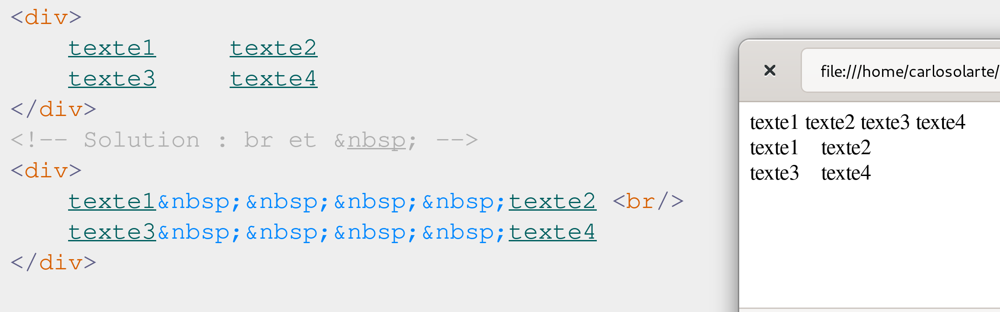
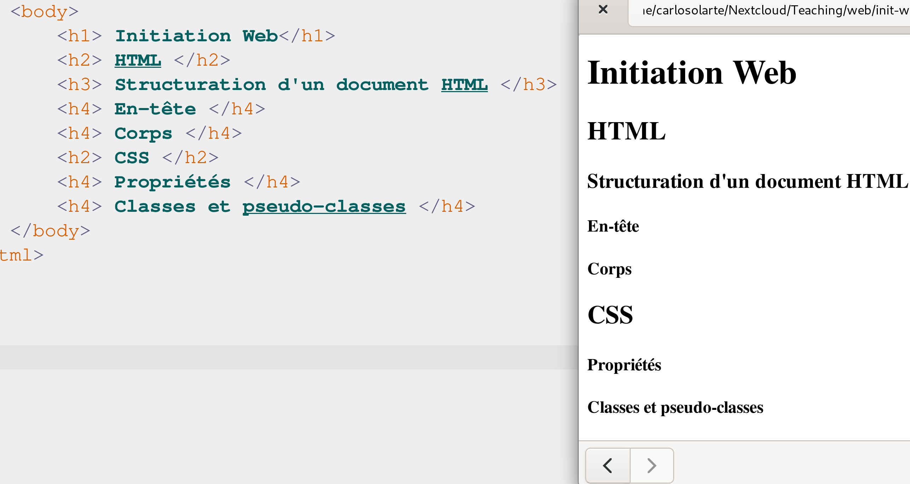

## Initiation Web (G1INWEB)
## HTML (CM1 et CM2)
---
## Déjà vu ...
---
### Internet
Internet est un ensemble de __réseaux interconnectés__,
utilisant un ensemble de _protocoles_ de communication et
_d'échanges de données_ standardisés.

---
### World Wide Web
Le World Wide Web est un système fonctionnant au-dessus
d'Internet, et basé sur des _liens hypertextes_. Il est
constitué de pages _Web_ organisées en __sites Web__,
lesquelles sont consultables grâce à un _navigateur_ Web

---
## HTML
---
### Objectives

Écrire et modifier des pages Web dans un langage normalisé de description de contenus (_HTML_).

---
### HTML (HyperText Markup Language) 

- Langage de _balisage d'hypertexte_
- Langage _standardisé_ utilisé pour la description des __pages Web__
- _Hyperlien_:  permet de passer d’un document à un autre
---
### HTML (Un peu d'histoire) 
- 1980 :  nécessité de publier, partager et retrouver des documents

Comment mentionner une autre page ?
---
### HTML (Un peu d'histoire) 
- 1980 :  nécessité de publier, partager et retrouver des documents

Comment mentionner une autre page ?

_Les liens hypertext_ : Permettent de __pointer__ vers une __autre page__

---
### HTML (Un peu d'histoire) 
- 1991 : proposition de _balises_

```html
Un paragraphe qui mentionne 
<a href="http://..."> une autre page </a>...
```
---
### HTML (Un peu d'histoire) 
- 1991 - 1993 : en l'absence de standard, ce sont les navigateurs Web
qui décident de facto de l'évolution de HTML


---
### HTML (Un peu d'histoire) 

- 1995 : spécification de HTML 2.0 par l'IETF (Internet Engineering Task
  Force), qui élabore les standards d'Internet
- 1996 : prise en main par le _W3C_ (__World Wide Web Consortium__).  
- W3C : 448 organisations membres en 2021 qui élabore les standards du Web
- 1997 : publication de HTML 3.2 par le W3C 
- 1997–1998 : publication de HTML 4.0 par le W3C 

---
### HTML (Un peu d'histoire) 
#### HTML5 : le nouveau standard
- 2008 : premier brouillon de la spécification
- 2011 : dernier appel pour contribuer à la spécification. 
- 2014 : publication du standard HTML5 par le W3C.

---
### L'intérêt du respect du standard
_Interopérabilité_ et _compatibilité_ entre navigateurs

> Une page Web peut ne pas s'afficher de la même façon selon les
navigateurs, même si elle respecte entièrement le standard HTML5, et
même si les navigateurs respectent eux aussi le standard.
Il convient donc d'en tester l'affichage sur les principaux navigateurs.

__Respecter le standard limite les différences potentielles d'affichage__
---
### Validation du code HTML
- Un non-respect de la syntaxe de HTML n'empêchera pas l'affichage sur le navigateur.
- Le navigateur affichera quelque chose (de non spécifié)


---
### Validateur du W3C
Un outil _indispensable_

http://validator.w3.org/


---
### Balises 


Source : [Commencer avec le HTML](https://developer.mozilla.org/fr/docs/Learn/HTML/Introduction_to_HTML/Getting_started)
---
### Balises 

Exemples : 
```html
<title> Le titre de mon  document </title>

<p> Un  paragraphe  dans  mon  document. </p>
```
- Les balises _structurent le contenu_ de la page (texte, images, etc.).
- Chaque balise a un __rôle__ et donne du __sens__ au contenu présenté.
- Chaque balise commence par le caractère __"<"__ et se termine par le caractère __">"__
- Ces balises _ne sont pas affichées_ par le navigateur car elles ne
  correspondent pas à du texte

---
### Balises et attributs
Exemples : 
```html


<a href="page.html">click! </a>
```
De manière générale:
```html
<balise att1="val1" att2="val2" attn="valn" > ...  </balise> 
```
---
### Balises et attributs
#### Balises auto-fermantes
- Certaines balises ne sont pas utilisées par paire
- il n’y a rien à mettre entre la balise ouvrante et la balise fermante

Exemple : 
 -  retour à la ligne : ` <br /> `  
 -  plus simplement :  `<br>`
 -  images  ``  
 -  ou :  ``
---

### Commentaires
- Ils facilitent la compréhension de votre code HTML
- Ils ne sont pas affichés par le navigateur 

```html
<!-- Ceci est un commentaire -->
```
> Mais on peut toujours voir le code source de la page ! 

---
### Structuration d'un document HTML

Deux grandes parties :
1. _En-tête_ : définition du titre, du codage, des mots-clés, etc.
- Information destinée aux machines (navigateur, robots, etc.)
2. _Corps_ : contenu de la page Web
- Information destinée à l'humain (et aux machines)


---
### Structuration d'un document HTML

- Un document conforme à la syntaxe de HTML5 _commence nécessairement_
par 
`<!DOCTYPE html>`
- `<html lang="fr">` : L'usage de l'attribut `lang` est fortement recommandé. 

---
### Structuration d'un document HTML
_En-tête_ : Entre les balises `<head>` et `</head>`

- __Titre__ : affiché dans le titre de la fenêtre du navigateur (__obligatoire !__)

`<title> Le titre de ma page Web </title>`
---
### Structuration d'un document HTML
_En-tête_ : Entre les balises `<head>` et `</head>`
- _Codage de caractères_ : `<meta charset="utf-8" />`

> Cette balise n'est pas obligatoire mais elle est  très fortement recommandée
---
### Structuration d'un document HTML
_En-tête_ : Entre les balises `<head>` et `</head>`
Information (optionnelle) pour les moteurs de recherche

- Auteur
- Description
- Mots-clés

`<meta name="author" content="Carlos Olarte" />`

---
### Structuration d'un document HTML


Voir [Exemple1](./exemples/ex1.html)
---
### Structuration d'un document HTML
_Indenter_ nous permet d'avoir un code plus lisible !


---
## Principales balises HTML
---
### Paragraphes
- _Paragraphe_ : Balise `<p> ... </p>`
- _Saute de ligne_ : Balise `<br />`

> Il est d'usage de créer un second paragraphe (`<p>`) plutôt
qu'un saut de ligne (`<br>`).
```html
<p> un premier paragraph </p>
<p> un second paragraph </p>
```

---
### Sections

Balise `<div>` : élément structurel (division ou section)
> Il est d'usage d'organiser la page Web en `<div>` _imbriquées_.

```html
<div>
	<!-- une première partie  -->
	<div>
		<p> texte 1 </p>
		<p> texte 2 </p>
	</div>
	<!-- une seconde partie  -->
	<div>
		<p> texte 3 </p>
		<p> texte 4 </p>
		<p> texte 5 </p>
	</div>
</div>
```
---
### Espaces 


Voir [Exemple 3](./exemples/ex3.html)

---
### Listes à puces 
- `<ul>` :  listes non-ordonnées (_u_nordered _l_ist)
- `<ol>` :  listes ordonnées (_o_rdered _l_ist)
- `<li>` : item (_l_ist _i_tem) 


Voir [Exemple 4](./exemples/ex4.html)

---
### Listes à puces 
Les listes peuvent être imbriquées aussi :
Voir [Exemple 4-2](./exemples/ex4-2.html)

#### Attribut `type` 
- `type="1"` : 1,2,3,...
- `type="A"` : A,B,C,...
- `type="a"` : a,b,c,...
- `type="I"` : I,II,III,...
- `type="i"` : i,ii,iii,...

---
### Ligne horizontale
- `<hr />` : ligne horizontale 

<hr>

---
### Quelques caractères spéciaux
- Espace insécable : `&nbsp;` 
- Signe inférieur à : `&lt;`   (<)
- Signe supérieur à : `&gt;`   (>)
- Esperluette (et commercial) : `&amp;` (&)
- Devises  : `&pound; &yen; &euro;`  ( £ ¥ €)

[Ici](https://fr.wikipedia.org/wiki/Liste_des_entit%C3%A9s_de_caract%C3%A8re_de_XML_et_HTML) la liste complète

---
### Les titres
- `<h1>` : titre de premier niveau
- `<h2>` : titre de second niveau
- ...
- `<h6>` : titre de sixième niveau

> Il est d'usage de n'avoir qu'un seul titre `<h1>` dans le document, et de
respecter l'ordre croissant des niveaux 

---
### Les titres



Voir [Exemple 6](./exemples/ex6.html)

---
### Soulignement et importance
- `<strong>` : forte importance (normalement s'affiche en gras)
- `<em>` :     emphase (s’affiche en général comme italique)
- `<mark>` : texte marqué (s'affiche en général comme souligné)

#### Modifier la police 
- `<b>` : gras (_b_old)
- `<i>` : italique
- `<u>` : souligné (_u_nderline)
---
### Soulignement et importance


Voir [Exemple 6](./exemples/ex6.html)
---
### Soulignement et importance
- `<strong>, <em>, <mark>` : 
 - Elles indiquent le _sens_ du texte
 - Mis en valeur du texte 
- `<b>, <i>, <u>` : 
 - Mettre en gras, italique ou souligné. 

> Il est d'usage d'utiliser `<strong>, <em>, <mark>` pour mettre
en valeur le texte. 

---
### Les liens hypertextes externes
- `<a href="LA_CIBLE">texte</a>`

#### Lien relatif 
`<a href="./exemples/ex4.html">Exemple 4</a>`
<a href="./exemples/ex4.html">Exemple 4</a>
#### Lien absolu
`<a href="https://www.univ-paris13.fr/">USPN</a>`
<a href="https://www.univ-paris13.fr/">USPN</a>

---
### Les liens hypertextes internes
- Lien vers une autre partie _du même document_
- `id=macible` :  pour définir l'endroit dans le document (__destination__)

```html
<h2 id="macible1"> texte  </h2>

<p id="macible2"> texte  </p>
```

- `<a href="#macible"> texte </a>` : pour définir le lien

Voir  [exemple 8](./exemples/ex8.html)

---
### Les liens hypertextes vers une adresse électronique
- `<a href="mailto:moi@univ.fr">Écrivez-moi</a>`

> _Attention_ : Cette utilisation est fortement déconseillée, du fait de la
> présence sur Internet de nombreux _robots malveillants_ qui récupèrent les
> adresses électroniques en clair pour envoyer des pourriel.

---
### Tableaux 
- `<table>` : Définition du tableau 
- `<tr>` : Définition d'une ligne (_t_able _r_ow)
- `<td>` : Contenu de la cellule (_t_able _d_ata)
- `<th>` : Cellules d'en-tête (_t_able _h_ead) 

Voir [Exemple 9](./exemples/ex9.html)

---
### Tableaux 
- `rowspan="n"` : indique sur combien de lignes s'étend la cellule
- `colspan="n"` : indique le nombre de colonnes sur lesquelles s'étend la cellule

Voir [Exemple 10](./exemples/ex10.html)

---
### Images
- Balise _auto-fermante_ : ``

#### Attributs  obligatoires 
- _src_ :  indique le nom du fichier de l'image 
- _alt_ : texte alternatif décrivant l'image

#### Autres  attributs 
- _title_ : Bulle d'information. 
- _width_ : La largeur intrinsèque de l'image en pixels
- _height_ : La hauteur intrinsèque de l'image en pixels. 

``

Voir [Exemple 11](./exemples/ex11.html)

---
### Images
- `figure` : Spécifier les illustrations, schémas, photos, listes de codes, etc.
- `figcaption` : Ajouter une légende

Voir [Exemple 11-2](./exemples/ex11-2.html)

---
### En-têtes et pieds de page

- `<header>` : en-tête de page
- `<footer>`  : pied de page 

Voir [Exemple 12](./exemples/ex12.html)

---
### Section de navigation
- `<nav>` : Section destinée à la navigation (menus, tables de matières, etc)

Voir [Exemple 13](./exemples/ex13.html)
---
### QCM

https://www.wooclap.com/IWCM2
