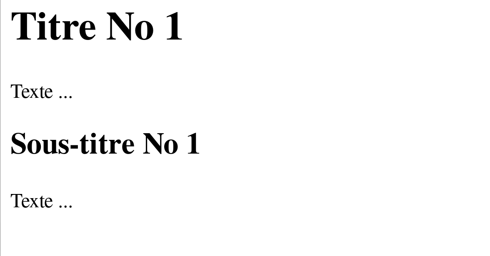

## Initiation Web (G1INWEB)
## CSS (CM3)
---
## Déjà vu ...
---
### HTML (HyperText Markup Language) 

- Langage de _balisage d'hypertexte_
- Langage _standardisé_ utilisé pour la description des __pages Web__
- _Hyperlien_:  permet de passer d’un document à un autre
---
### Balises 


Source : [Commencer avec le HTML](https://developer.mozilla.org/fr/docs/Learn/HTML/Introduction_to_HTML/Getting_started)
---
### Balises 

Exemples : 
```html
<title> Le titre de mon  document </title>

<p> Un  paragraphe  dans  mon  document. </p>
```
- Les balises _structurent le contenu_ de la page (texte, images, etc.).
- Chaque balise a un __rôle__ et donne du __sens__ au contenu présenté.
- Chaque balise commence par le caractère __"<"__ et se termine par le caractère __">"__
- Ces balises _ne sont pas affichées_ par le navigateur car elles ne
  correspondent pas à du texte

---
### Structuration d'un document HTML

Deux grandes parties :
1. _En-tête_ : définition du titre, du codage, des mots-clés, etc.
- Information destinée aux machines (navigateur, robots, etc.)
2. _Corps_ : contenu de la page Web
- Information destinée à l'humain (et aux machines)

---
##  Aujourd'hui 


Source : [interviewbit](https://www.interviewbit.com/)

---
### Mettre en forme une page Web

- Balise `<span>` : conteneur générique _en ligne_
- Attribut `style` : Par exemple, `color=COULEUR`

Changer la couleur :

```html
Le texte en <span style="color:blue">blue</span> 
et le texte en <span style="color:red">rouge</span> 
```
---
### Mettre en forme une page Web
- Et si je veux changer la couleur de tous les titres ?
- Et si je veux tous les mots importants en rouge ?

En général, le formatage du texte est géré non par HTML mais par une
feuille  de style _CSS_ 

---
### CSS

- _Cascading_ Style Sheets
- Feuilles de style en cascade
- Standard développé par le W3C.

---
### CSS

Principe de séparation :    
 - Fond : _HTML_
 - Forme :  _CSS_

> Un site HTML bien conçu devrait ne contenir aucune information de style
---
### HTML 
Structure / Fond 


---
### HTML + CSS
Mis en forme 


---
### HTML + CSS
Mis en forme 


---
### CSS : Syntaxe générale 


---
### CSS : Syntaxe générale 


- _Sélecteur_ : Désigne les éléments d'un document concernés par la règle
- _Déclarations_ : propriété et valeur 

---
### Fichier CSS


- Comment inclure la feuille de style dans la page HTML ?
---
### Fichier CSS
__À éviter !!!__

```html
<h1 style="color : white ; 
        background-color : black ; 
        font-weight : bold"> 
        Titre No 1</h1>

```
> Un site HTML bien conçu devrait _ne contenir aucune_ information de style

---
### Fichier CSS
Style dans l'en-tête (`<head>`)


Vaguement mieux ... Mais si mon site a plusieurs pages HTML ?

---
### Fichier CSS
- Fichier ayant l'extension _.css_
- Syntaxe insensible aux espaces et retours à la ligne 
- L'_indentation_ est __fortement recommandée__
---
### Fichier CSS


- `rel` (__obligatoire__) : indique la nature de la relation établie entre deux ressources 
- `feuille.css` est un fichier de code CSS qui va permettre de _styliser le document actuel_

---
### Fichier CSS
feuille.css
```css
h1{
    color : white;
    font-weight : bold;
    background-color: black;
}
```
- Définition des propriétés de `<h1>`
- Voir [Exemple](./exemples/ex1)
---
### Fichier CSS

Les avantages de cette méthode :
- _Séparation totale_ de la structure et de la présentation 
- Possibilité d’avoir des présentations __alternatives__
- Possibilité d’appliquer la même feuille de style sur plusieurs pages 
- _Cohérence_ de la présentation sur tout le site et les pages futures.
---
### Commentaires 
Code CSS qui __n’est pas exécuté__, donc non pris en compte par le navigateur
```css
h1{
    /* Titre h1 */
    color : white;
    /* font-weight : bold; */
    background-color: black;
}
```

- Les commentaires restent _visibles_ dans la source de la feuille de style
- Attention à ne pas y laisser d’informations confidentielles !

---
## Les principales propriétés et leurs valeurs
---
### Modification de la police
#### font-size :  taille de la police 
_Valeurs absolues_ 

- xx-small
- x-small
- small
- medium (_par défaut_) 
- large
- x-large
- xx-large

Voir [exemple](./exemples/ex2/page.html)

---
### Modification de la police
#### font-size :  taille de la police 
_Valeurs relatives_ 
- larger (plus grande que celle de l'élément _parent_)
- smaller 

Voir [exemple](./exemples/ex2/page.html)

---
### Modification de la police
#### font-size :  taille de la police 
_Valeurs numériques_
- `font-size : 12px;` : taille en pixels (déconseillée)
- `font-size : 0.5em;` : la taille est la moitié de celle utilisée pour l'élément parent

Voir [exemple](./exemples/ex2/page.html)
---
### Modification de la police
#### font-weight :  graisse de la police

- lighter
- normal
- bold
- bolder
- Valeurs numériques entre 0 et 1000 

> Les niveaux de graisse disponibles _dépendent de la police_. 
> Certaines fontes n'existent qu'avec les niveaux de graisses `normal` et `bold`.

Voir [exemple](./exemples/ex2/page2.html)
---
### Modification de la police
#### font-style :  inclinaison de la police 
- normal
- italic 

Voir [exemple](./exemples/ex2/page2.html)
---
### Modification de la police
#### text-decoration :  décoration (soulignage, surlignage)
- underline
- overline
- line-through
- none
- color : couleur de la ligne 
- dotted 
- wavy

Voir [exemple](./exemples/ex2/page2.html)

---
### Modification de la police
#### font-family : famille de la police de caractères 
-  Grandes familles : serif, sans-serif, mono, monospace
-  Nom de police : Arial, Courier New, Courier, Helvetica, Times ...

- `font-family` permet de définir une liste _ordonnée par priorité_. 
-  Le navigateur choisira la première police installée sur l'ordinateur 
- `@font-face` : polices chargées depuis un fichier 

Voir [exemple](./exemples/ex2/page3.html)

---
### Modification de la police
#### Capitales 
`font-transform` : police en capitales / minuscules 

- capitalize (première lettre)
- uppercase (capitales)
- lowercase (minuscules) 
- none (normal)

Voir [exemple](./exemples/ex2/page3.html)
---
### Modification du texte
`text-align` :  permet de spécifier l'alignement horizontal du texte
- left : alignement à gauche 
- right : alignement à droite 
- center : centré
- justify : texte justifié 

Voir [exemple](./exemples/ex2/page4.html)

---
### Couleurs 
`color` : couleur de la police 

- Couleurs _prédéfinies_ : red, blue, green ... (~ 140 couleurs)
- Code _hexadécimal_ : composé de trois chiffres hexadécimaux représentant les
  tons de __rouge__, de __vert__ et de __bleu__. Il permet de définir plus de 16 millions
  de couleurs (ex. `#4B0082`).

---
### Couleurs 
`color` : couleur de la police 

- _Code RGB_ : définit les composantes de __rouge__, __vert__ et __bleu__ en
  indiquant leur proportion en pourcentage ou en notation absolue (0-255).
  Ex. `rgb(75,0,130)`. 
- _Code HSL_ : Hue, Saturation, Luminosity (Teinte, Saturation, Luminosité). Ex. `hsl(16,100%,50%)`

Voir la liste de couleurs [ici](https://fr.wikipedia.org/wiki/Couleur_du_Web)
Outils : [gcolor3](https://github.com/Hjdskes/gcolor3)

[Exemple](./exemples/ex2/page5.html)

---
### Couleurs de fond
- `background-color` : indique la couleur de fond

[Exemple](./exemples/ex3/page1.html)

---
### Les flottants
- `float` : faire "flotter" un élément au tour du texte 
- Valeurs : `right` ou `left`
- `clear` : l'élément ne continue pas à flotter.
- Valeurs : `right`, `left`, `both` 

Voir [Exemple](./exemples/ex3/page.html)

---
### Images de fond
- `background-image: url("image.png")`

* [Exemple répétition](./exemples/ex3/page4.html)
* [Exemple répétition Y](./exemples/ex3/page4a.html)
* [Exemple cover ](./exemples/ex3/page4b.html)

---
### Identifiants et classes

```css
h2{
    ...
}
```

Toutes les balises `<h2>` sont modifiées 
---
### Identifiants et classes
#### Identifiants 
* Syntaxe _HTML_ : `<h1 id="titre">`
* Syntaxe _CSS_ : `#titre { ... }`
* Utilisation _unique_ (un seul `id="titre"` dans la page HTML)
---
### Identifiants et classes
#### Classes
* Syntaxe _HTML_ : `<h1 class="titre">`
* Syntaxe _CSS_ : `.titre { ... }`
* Utilisation multiple (plusieurs `class="titre"` autorisés dans la page HTML)

---
### Identifiants et classes
#### Conteneurs
Destinés à _structurer_ le contenu.

- `<span class...>` ou `<div class...>` : appliquer une classe à une portion de code
  HTML qui n’est pas délimitée par des balises
- `<span id...>` ou `<div id...>` : idem pour les identifiants. 

- _Div_ : Pour les _blocs_
- _Spam_ : Pour les lignes (__"inline"__) 

[Exemple](exemples/ex3/page2.html)

---
### Héritage

* Les propriétés CSS _héritent_ des propriétés parentes. 

Voir [Exemple](./exemples/ex3/page3.html)

---
### Combinaisons de sélecteurs
```css
h2{
    ...
}
```
Toutes les balises `<h2>` sont modifiées 
---
### Combinaisons de sélecteurs

```css
X,Z{
    ...
}
```
Les modifications s’appliquent aux éléments X et aux éléments Z

Voir [Exemple](./exemples/ex4/page0.html)

---
### Combinaisons de sélecteurs

```css
X Z{
    ...
}
```
Correspond à tout élément  Z qui est un _descendant_ de l'élément X

Voir [Exemple](./exemples/ex4/page.html)

---
### Combinaisons de sélecteurs

```css
X>Z{
    ...
}
```
Correspond à tout élément  Z qui est un _enfant_ de l'élément X

Voir [Exemple](./exemples/ex4/page1.html)

---
### Combinaisons de sélecteurs

```css
*{
    ...
}
```
Tous les éléments 

Voir [Exemple](./exemples/ex4/pageetoile.html)

---
### Combinaisons de sélecteurs

```css
X~Z{
    ...
}
```
Correspond à tous les Z qui _suivent_ un élément X et qui sont __au même niveau__ (voisins / frères et sœurs)

Voir [Exemple](./exemples/ex4/page2.html)

---
### Combinaisons de sélecteurs

```css
X+Z{
    ...
}
```
Correspond à l’élément directement suivant à X 

Voir [Exemple](./exemples/ex4/page3.html)

---
### Combinaisons de sélecteurs

```css
X.maClasse{
    ...
}
```
Correspond à tout élément X ayant comme classe "maClasse"

Voir [Exemple](./exemples/ex4/page4.html)

---
### Combinaisons de sélecteurs

```css
.maClasse X{
    ...
}
```
Correspond aux éléments X descendants d’un élément ayant comme classe maClasse 

Voir [Exemple](./exemples/ex4/page5.html)

---
### Combinaisons de sélecteurs

- __`#abc p.rouge > a`__ :  cible les liens qui sont _enfants_ de paragraphes
  appartenant à la classe "rouge", eux-mêmes _descendants_ d'éléments dont
  l’identifiant est "abc".
- __`p > em.rouge.Italique,   h1.bleu`__ : cible les éléments mis en
  valeur par la balise em appartenant aux classes "rouge" et "Italique" et
  enfants de paragraphes, ou alors aux éléments h1 appartenant à la classe
  "bleu".
- __`p.rouge`__ : les paragraphes appartenant à la classe "rouge"
- __`p .rouge`__ : les éléments appartenant à la classe"rouge" et descendants d’un paragraphe.

---
### Combinaisons de sélecteurs
#### pseudo-éléments et pseudo-classes

* `first-child` : désigne le premier enfant d'un élément
* `A[B]` : Tous les éléments A avec un attributs B

---
### Validateur

https://jigsaw.w3.org/css-validator/
---
### Jeu
https://flukeout.github.io/
