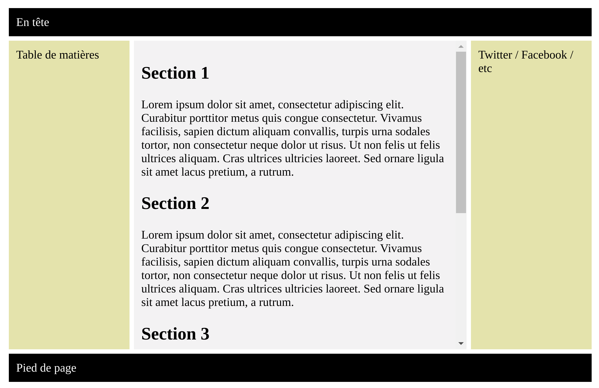
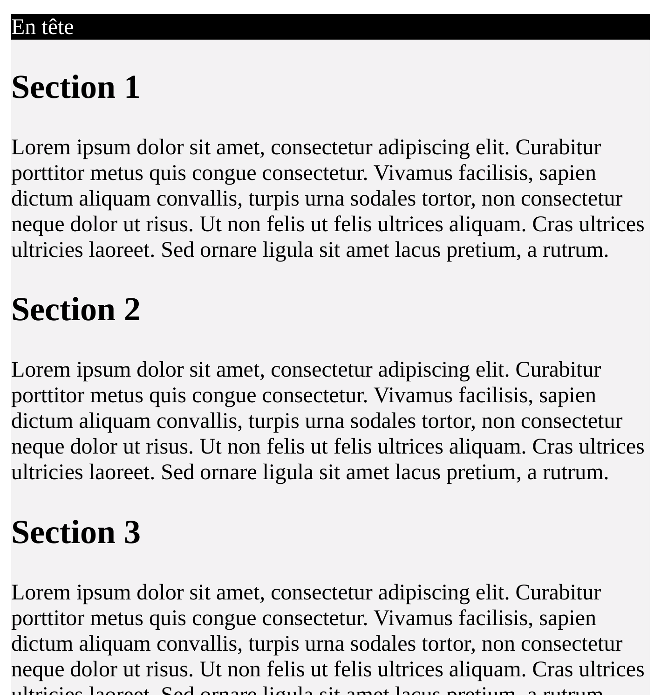

## Initiation Web (G1INWEB)
## Flexbox et sites adaptatifs
---
### Flexbox
- Module des _boîtes flexibles_
- Distribuer l'espace entre des objets d'une interface

__Toutes les images dans les diapositives__ : 
* [developer.mozilla.org](https://developer.mozilla.org/fr/docs/Web/CSS/CSS_Flexible_Box_Layout/Basic_Concepts_of_Flexbox)
* [A Complete Guide to Flexbox](https://css-tricks.com/snippets/css/a-guide-to-flexbox/)

---
### Les concepts de base

* Les deux _axes_ : 
 - principal 
 - secondaire 
* Tailler des élements :
 - largeur (_width_)
 - hauteur (_height_)
* Deux types :
 - Le conteneur 
 - Les éléments 

---
### Les concepts de base


---
### Les concepts de base


---
### L'axe Principal

Propriété _flex-direction_:
- row
- row-reverse
- column
- column-reverse
---
### L'axe Principal
`flex-direction : row` : 


---
### L'axe Principal
`flex-direction : column` : 


---
### L'axe secondaire
- _Perpendiculaire_ à l'axe principal
- si `flex-direction : row` donc


---
### L'axe secondaire
- _Perpendiculaire_ à l'axe principal
- si `flex-direction : column` donc


---
### Flex direction reverse 


---
### Le conteneur flexible
```
.container{
    display : flex;
    flex-direction : row ;
}

<div class="container">
 ...
</div>
```


[Exemple](./exemples/ex1/page.html)
---
### Conteneur flexible sur plusieurs lignes 
- _Propriété_ : `flex-wrap` 
- _Valeurs_ : `nowrap | wrap | wrap-reverse`
- `wrap` : les éléments sont placer sur  _plusieurs lignes_


[Exemple](./exemples/ex2/page.html)

---
### flex-flow

- Propriété : `flex-flow`
- `flex-flow` = `flex-direction` + `flex-wrap`

```
.container{
    flex-flow : column wrap ;
}
```
---
### Les éléments flexibles 

L'espace disponible 


- _Conteneur_ : 500px
- _Éléments_ : 100px 

---
### Les éléments flexibles 
- Propriété : `flex-basis`
- Valeurs : `auto` ou une dimension (px ou %)
- _auto_ : le navigateur utilise la taille (width/height) de l'élément 

---
### Les éléments flexibles 
- Propriété : `flex-grow`
- Valeurs : un entier 
- Elle permet de répartir l'espace disponible (_facteur d'expansion_)


---
### Les éléments flexibles 
- Propriété : `flex-grow`
- Valeur 0 (_valeur par défaut_) : la dimension de l'élément ne change pas. 

[Exemple](./exemples/ex5/page.html)

---
### Les éléments flexibles 
- Propriété : `flex-shrink`
- Valeurs : un entier 
- Réduire la taille s'il n'y pas d'espace dans le conteneur 

---
### Les éléments flexibles 
- Propriété : `flex`= `flex-grow` + `flex-shrink` + `flex-basis`

``` 
.elem1{
    flex : 1 2 auto ;
}
```
---
### Justification 
- Propriété : `justify-content`
- Valeurs : `flex-start` `flex-end` `center` `space-around` `space-between` `space-evenly`

> Alignent  des éléments le long de l'axe principal 

---
### Justification 


---
### Align items 
- Propriété : align-items
- Valeurs : `stretch` `flex-start` `flex-end` `center` `baseline`

> Alignent  des éléments le long de l'axe secondaire 
---
### Align items 


---
### align-content
- Propriété : `align-content`
- Valeurs : `flex-start` `flex-end` `center` `space-between` `space-around` `space-evenly` `stretch`

> Alignent quand il y d'espace disponible sur l'axe secondaire (et plusieurs lignes) 
---
### align-content


---
### gap, row-gap, column-gap

Contrôler l'espace entre les éléments 
```
.container{
    display : flex;
    gap : 5px 7px; // row-gap + column-gap 
    ...
}
```
---
### gap, row-gap, column-gap


---
### Ordre 
- Propriété : order
- Valeur : nombre entier ... -2,-1,0,1,2,3...
- 0 : valeur par défaut 

> _order_ définit l'ordre avec lequel le navigateur va  afficher les éléments
---
### Ordre 
- Propriété : order

[Exemple](./exemples/ex6/page.html)

---

### Exemples 
#### Centrer les éléments 

Un exemple de quatre images centrées (verticalement et horizontalement)
[Exemple](./exemples/ex4/page.html)
---
### Exemples 
#### Exemple article,header, footer, etc


---
### Exemples 
#### Exemple article,header, footer, etc
La _structure_ (balises __sémantiques / structurelles__) :
- `header` : en tête
- `article` : section principal 
- `aside` : aparté (rapport indirect avec le contenu principal)
- `footer` : pied de page 
---
### Exemples 
#### Exemple article,header, footer, etc
Taille des éléments :
```
.main {
  flex : 3 0 0px;
  ...
}
#aside1 {
  flex : 1 0 0px;
  ...
}
#aside2 {
  flex : 1 0 0px;
  ...
}
footer {
  width : 100%;
  ...
}
```
---
### Exemples 
#### Exemple article,header, footer, etc
Le résultat : [Exemple](./exemples/ex7/page.html)
---
## Site Web adaptatifs
---
### Le problème 
La consultation d’un site Web peut se faire depuis des _appareils très
divers_ :
 * Ordinateur de bureau à écran 34 pouces
 * Ordinateur portable
 * Tablette
 * Téléphone intelligent (ou non)
 * Télévision

> Comment assurer un affichage _optimal_ pour tous ?
---
### Solution : les sites Web adaptatifs
>  _Responsive Web Design_

La conception de sites Web _adaptatifs_ regroupe
différents principes et technologies ayant pour but de __faciliter la
consultation__ d’un site Web de façon optimale __quel que soit l’appareil utilisé__.

---
### La règle `@media`

- Import de _différentes_ feuilles de style __en fonction du navigateur__ (taille
de l’écran, type de système, etc.)
- Redimensionnement de blocs ou d’images
- __Personnalisation__ de parties de la feuille de style

---
### Importation conditionnelle 
```html
<link rel="stylesheet" 
      media="only screen and min-device-width:480px "
      href="bureau.css" type="text/css" />

<link rel="stylesheet"
        media="handheld , ( max-device-width:480px )"
        href="smartphone.css" type="text/css" />
```
- Si appareil de type _screen_ __et__ taille de l’écran supérieure à 480 px :
utilisation de bureau.css
- Si appareil de type _handheld_ __ou__ taille de l’écran inférieure à 480 px :
utilisation de smartphone.css

---
### Conditions à l’intérieur d’une feuille de style 
```
@media only screen and ( max-device-width:480px ) {
    header {
        width: 100%;
    }
}
```
---
### Conditions à l’intérieur d’une feuille
En écran 


---
### Conditions à l’intérieur d’une feuille
En petit écran 



[Exemple](./exemples/ex8/page.html)

---
## Flexbox Games

- https://flexboxfroggy.com/
- http://www.flexboxdefense.com/

