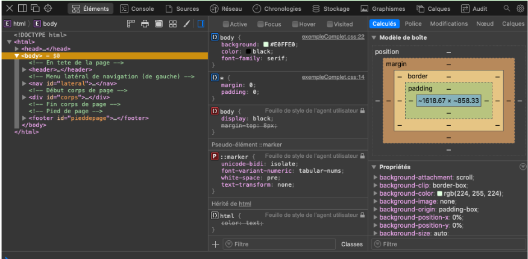

## Initiation Web (G1INWEB)
## Tableaux, formulaires et media 
---
### Tableaux  (HTML)
- `<table>` : Définition du tableau 
- `<caption>` : Titre du tableau
- `<tr>` : Définition d'une ligne (_t_able _r_ow)
- `<td>` : Contenu de la cellule (_t_able _d_ata)
- `<th>` : Cellules d'en-tête (_t_able _h_ead) 

---
### Tableaux  (HTML)
Balises _sémantiques_ :

- `<thead>` : l'en-tête du tableau 
- `<tbody>` : le corps du tableau
- `<tfoot>` : le pied du tableau 

_tfoot_ est normalement utilisé pour des long tableaux  
---
### Tableaux 
- `rowspan="n"` : indique sur combien de lignes s'étend la cellule
- `colspan="n"` : indique le nombre de colonnes sur lesquelles s'étend la cellule
---
### Tableaux  (HTML)
```html
<table>
  <caption>légende du tableau </caption>
  <thead> <!-- En-tête -->
    <tr>
        <th> Col 1</th>
        <th> Col 2</th>
    </tr>
  </thead>
  <tbody> <!-- Corps  -->
    <tr>
        <td> Data 1.1</td>
        <td> Data 1.2</td>
    </tr>
    <tr>
        <td> Data 2.1</td>
        <td> Data 2.2</td>
    </tr>
  </tbody>
  <tfoot> <!-- Pied du tableau -->
    <tr>
        <th> Col 1</th>
        <th> Col 2</th>
    </tr>
  </tfoot>
</table>
```

---
### Propriétés CSS  (`table`)

- _`table-layout`_ : définit l'algorithme utilisé pour disposer les éléments du tableau
- Valeur __`auto`__ :  La largeur du tableau et de ses cellules dépendent de leur contenu
- Valeur __`fixed`__ : Dimensionner les colonnes selon la largeur de leurs en-têtes

---
### Propriétés CSS  (`table`)

`border` : définir les propriétés liées à la bordure

Exemples : 
```css
border : solid ;
border : dashed red ;
border : thick double #32a1ce;
border : 4px dotted black;
```

---
### Propriétés CSS  (`table`)

_`caption-side`_ : choisir l'emplacement de la légende
- Valeur __`top`__ : au-dessus du tableau.
- Valeur __`bottom`__ : au-dessous du tableau.

---
### Propriétés CSS  (`table`)

_`border-collapse`_ : détermine si les bordures d'un tableau sont séparées ou fusionnées
- Valeur __`collapse`__ :  bordures fusionnées
- Valeur __`separate`__ :  bordures séparées 

---
### Propriétés CSS  (`table`)

Voir [exemple](./exemples/ex1/page.html)

---
### Propriétés CSS  (cellules)
```css
thead th, tfoot th {

}

tbody td {
    
}
thead, tfoot {

}
```
---
### Propriétés CSS 
Zébrures

```css
tbody tr:nth-child(odd) {
  background-color: #ff33cc;
}

tbody tr:nth-child(even) {
  background-color: #e495e4;
}
```

---
### Propriétés CSS 
```css
caption {

}
```
Voir [Exemple](./exemples/ex2/page.html)

---
### scope
- balise _`colgroup`_ : définit un groupe de colonnes
- attribue __span__ : nombre de colonnes consécutives 

```html
< colgroup >
        < col >
        < col span="2" class="class1" >
        < col span="2" class="class2" >
< /colgroup >
```

Voir [Exemple](./exemples/ex3/page.html)
---

### Formulaires 

- Définition d'un formulaire 
- Les _zones de saisie_
- Traitement des données : On a besoin d'un __backend__ (PHP, Ruby, Javascript, Python, Java, CGIs, etc)

---
### Protocole HTTP
- Client: _requête_ "je voudrais https://www.univ-paris13.fr/"
- Traitement : préparation de la page Web
- _Réponse_ : code (HTML) pour être visualisé pour le navigateur
---
### Protocole HTTP
Métodes de requêtes 
- _GET_ : demander une ressource 

```
GET docs/page.html
```
 le serveur renvoie le fichier `page.html`
---
### GET
```
https://www.google.com/search?q=linux&sourceid=chrome
```
- Informations supplémentaires (_parametres_) 
- Commence par point d'interrogation "?"
- nom (`q`) `=` valeur (`linux`)
- les paramètres sont relies avec un "&"
---
### POST
- Utilisé pour envoyer de grandes quantités de données (e.g., fichiers)
-  La méthode POST n'écrit pas les paramètres dans  l'URL (plus sécurisé) 
- Normalement utilisée pour les formulaires en ligne 

```html
<form action="action.php" method="post">
    <input type="text" id="name" name="name">
    ...
    <input type="submit" value="Submit">
</form>
```
---
### Formulaires 
- Balise `<form>` :  indique le début et la fin du formulaire
- Attribut `method` :  indique par quel moyen les données vont être envoyées
- Valeurs : `GET` et `POST`
- Attribut `action` : adresse de la page qui va traiter les données. 

---
### Les éléments `<label>` et `<input>`

- _label_ : étiquette
- _input_ : un champ de texte 

```html
<div>
  <label for="nom">Nom :</label>
  <input type="text" id="nom" name="nom">
</div>
```
---
### Les éléments `<label>` et `<input>`
- _id_ : pour identifier l'élément (ex. en CSS)
- _name_ : identifier l'élément d'information collecté (backend) 

Des autres attributs : 
-  _`required`_ : l'utilisateur doit spécifier une valeur
-  _`placeholder`_ : texte indicatif

---
### Backend

```php
< ?php
 $nom = $_GET['nom'] ; // Attribut name="nom" en HTML
 // $_POST['nom'] (si la méthode est POST)
 echo "Bonjour " . $nom ;
? >
```
---
### Les éléments `<email>` et `<password>`
- _`email`_ : adresse email 
- _`password`_ : mot de passe

```html
<input type="email" id="email" name="email">

<input type="password" id="pwd" name="pwd">
```
---
### Des autres types de champs 

- `search` : petite différence d'affichage 
- `tel` : numéros de téléphones (clavier virtuel différent pour les mobiles)
- `url` : validation spéciale pour les URLs
- `number` : nombres

```html
<input type="number" name="age" id="age" min="1" max="10" step="2">
```

---
### Date et heure

```html
<input type="datetime-local" name="datetime" id="datetime">
<input type="month" name="month" id="month">
<input type="time" name="time" id="time">
<input type="week" name="week" id="week">
<input type="date" min="2013-06-01" max="2013-08-31" id="maDate">
```

---
### Champs de texte multilignes 

- `textarea` 

```html
<textarea cols="30" rows="10"></textarea>
```
---
### Contenu déroulant 
- _Boîte à sélection_ : 

```html
 <select>
      <option>Bordeaux</option>
      <option>Lyon</option>
      <option>Paris</option>
</select>
```
Attributs pour la balise `<option>` : 
-  _`selected`_ : définit la valeur par défaut de la boîte de sélection
- _`value`_ : une valeur pour être envoyé (différent du contenu) 

---
### Contenus auto-complétés

`<datalist>` : permit de suggérer des valeur pour un élément

```html
<input type="text" id="ville" list="listVilles" />
<datalist id="listVilles">
  <option>Bordeaux</option>
  <option>Lyon</option>
  <option>Paris</option>
</datalist>
```
---
### Éléments à cocher 

- `checkbox` : Case à cocher

```html
< input type="checkbox" checked id="accord" name="accord" value="accord" >
```

Attribut : 
- _`checked`_ : la case sera cochée au chargement de la page

---
### Éléments à cocher 
- `radio` : Bouton radio

```html
< input type="radio" checked id="bordeaux" name="ville" value="bordeaux" >
< input type="radio"  id="lyon" name="ville" value="lyon" >
< input type="radio"  id="paris" name="ville" value="paris" >
```
---
### Boutons
- `submit` : envoyer les données 
- `reset` : réinitialiser les éléments
- `button` : action personnalisé en utilisant Javascript. 

```html
<input type="submit" value="Envoyer">
<input type="reset" value="Reset">
<input type="button" value="Click me!">

```

--- 
### Sélecteur de couleur 

```html
<input type="color" name="color" id="color">
```
--- 
### Sélection de fichier 

```html
< input type="file" name="file" id="file" accept="image/*" >
```

Attributs :
- `multiple` : plusieurs fichiers 
- `accept` :  définit les types de fichier 
 * ".doc,.docx,application/msword"
 * ".pdf"
 * "image/*"
 
---
### Ensembles de champs

- `<fieldset>` : regroupe des éléments d'un formulaire
- `<legend>` : description du groupe 
```html
<form>
    <fieldset>
        <legend> Parcours et études </legend>
        <input ...>
        <input ...>
    </fieldset>
</form>
```

---
### Un exemple 

Voir [exemple](./exemples/ex4/page.html)

---
# Éléments multimédia 

---
### Images
- Balise _auto-fermante_ : ``

Attributs  obligatoires 
- _src_ :  indique le nom du fichier de l'image 
- _alt_ : texte alternatif décrivant l'image

Autres  attributs 
- _title_ : Bulle d'information. 
- _width_ : La largeur intrinsèque de l'image en pixels
- _height_ : La hauteur intrinsèque de l'image en pixels. 

---
### Images
- `figure` : Spécifier les illustrations, schémas, photos, listes de codes, etc.
- `figcaption` : Ajouter une légende

---
### Élément audio
- Balise `<audio>` : insérer un élément audio

Attributs : 
- `src` : URL du fichier 
- `controls` : ajouter les boutons (lecture, pause)

Voir [exemple](./exemples/ex5/page.html)
---
### Vidéos 
- Balise `<video>` : insérer une vidéo 

Attributs : 
- `src` : URL de la video
- `controls` : ajouter les boutons (lecture, pause)
- `width` / `height` : taille de la video
- `poster` : image à afficher 

Voir [exemple](./exemples/ex5/page-vid.html)
---
### Techniques d'intégration

- Balise `<iframe>` : permet d'intégrer un document web entier dans un autre
---
### Techniques d'intégration

- Balise `<iframe>` : permet d'intégrer un document web entier dans un autre

Intégrer une vidéo de [Youtube](https://support.google.com/youtube/answer/171780?hl=fr) ou une playlist

1. Sur un ordinateur, accédez à la vidéo 
2. Cliquez sur PARTAGER .
3. Dans la liste des options de partage, cliquez sur Intégrer.
4. Copiez le code HTML figurant dans la zone qui s'affiche.

Voir [exemple](./exemples/ex5/page-youtube.html)
---
### Techniques d'intégration

- Balise `<iframe>` : permet d'intégrer un document web entier dans un autre

Ça marche aussi pour Google maps !

Voir [exemple](./exemples/ex5/page-maps.html)

---
### Techniques d'intégration

- Balise `<iframe>` : permet d'intégrer un document web entier dans un autre

En effet, on peut integrer des autres pages :

Voir [exemple](./exemples/ex5/page-page.html)
---

## Site Web adaptatifs
---
### Le problème 
La consultation d’un site Web peut se faire depuis des _appareils très
divers_ :
 * Ordinateur de bureau à écran 34 pouces
 * Ordinateur portable
 * Tablette
 * Téléphone intelligent (ou non)
 * Télévision

> Comment assurer un affichage _optimal_ pour tous ?
---
### Solution : les sites Web adaptatifs
>  _Responsive Web Design_

La conception de sites Web _adaptatifs_ regroupe
différents principes et technologies ayant pour but de __faciliter la
consultation__ d’un site Web de façon optimale __quel que soit l’appareil utilisé__.

---
### La règle `@media`

- Import de _différentes_ feuilles de style __en fonction du navigateur__ (taille
de l’écran, type de système, etc.)
- Redimensionnement de blocs ou d’images
- __Personnalisation__ de parties de la feuille de style

---
### Conditions à l’intérieur d’une feuille de style 
```
@media only screen and ( max-device-width:480px ) {
    header {
        width: 100%;
    }
}
```
---
### Conditions à l’intérieur d’une feuille de style 

Taille du périphérique ou de la zone d'affichage 
- `height`  : hauteur de la fenêtre
- `width`  : largeur de la fenêtre
- `device-height`  : hauteur du périphérique 
- `device-width`  : largeur du périphérique 
- `orientation` : portrait ou paysage

> Prefixes `min-` et `max-` : min-width, max-device-width, etc. 

---
### Conditions à l’intérieur d’une feuille de style 

`media` : type d'écran
- `screen` : écran
- `handheld` : mobile (pas très standard) 
- `print` : impression
- `tv` : telévision

---
### Combiner les conditions
- `only` : uniquement
- `and` : et
- `not` : non
- ` , ` : `c1, c2` = c1 _ou_ c2

---
## Dernières mots 
---
### Outils d'inspection

Chrome : tools -> developer tools


---
### Validation

- HTML : https://validator.w3.org/
- CSS : https://jigsaw.w3.org/css-validator/

---
### Continuer à apprendre !
- La technologie web change rapidement
- Il faut maitriser des autres langages : Javascript 
- Backend : PHP, Python, Java, C, Ruby, Javascript, etc. 
---
## Merci !
